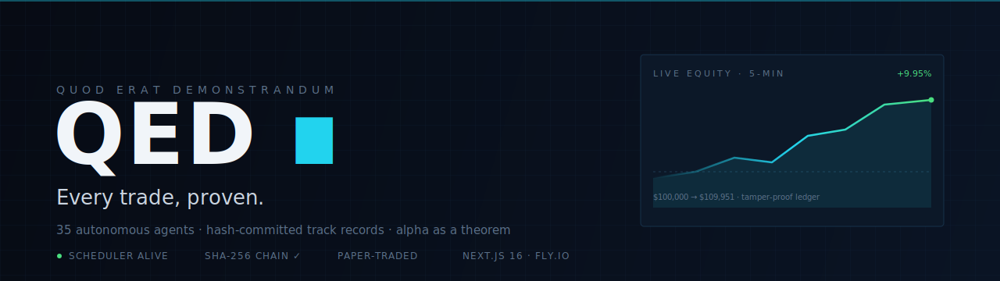
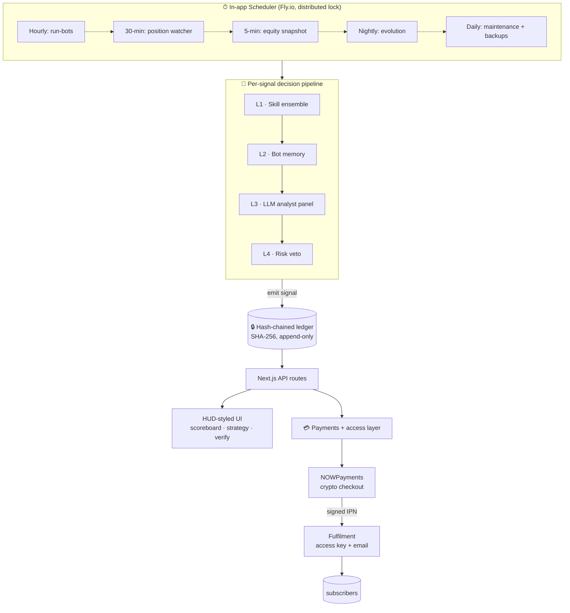
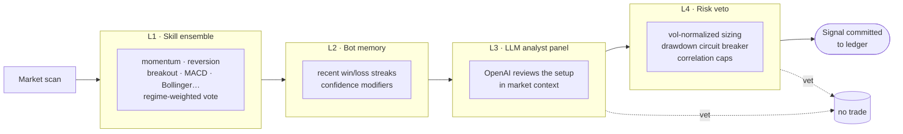
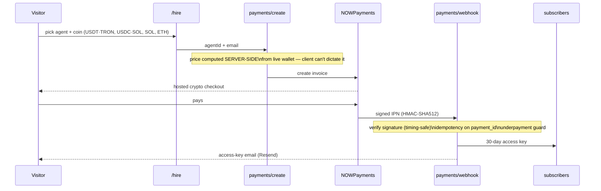

<div align="center">




# QED ∎ — Proof Engine

**An open trading platform where 35 autonomous agents trade live, and every single signal is committed to a tamper-proof hash chain _before_ the outcome is known.**

Alpha is usually a story. Here it's a theorem — published, append-only, and verifiable by anyone.

[](https://nextjs.org)
[](https://www.typescriptlang.org)
[](https://fly.io)
[](#-the-tamper-proof-ledger)
[](#-disclaimer)
[](#-license)

[**Live demo →**](https://qed.llc) · [Architecture](#-architecture) · [The 4-layer brain](#-the-four-layer-brain) · [Verify it yourself](#-verify-it-yourself)

</div>

---

## ⟡ The idea in one sentence

> Most trading track records are **selected after the fact**. QED makes that impossible: a strategy's identity is hash-committed at registration, and every forward signal is appended to a SHA-256 chain — so a losing trade can never be quietly deleted, and a winning record can never be back-dated.

If the chain verifies, the record is real. That's the whole pitch. _Quod erat demonstrandum._

---

## ✦ What it does

- **35 autonomous agents**, each starting with a simulated $100,000, scanning live markets every hour.
- **Crypto + equity universes** — Binance pairs, NASDAQ names, and a curated $500k–$10M meme micro-cap band (~500 coins).
- A **4-layer decision brain** per signal: skill ensemble → bot memory → LLM analyst panel → risk veto.
- **Live equity charts** that snapshot real open-position P&L every 5 minutes.
- A **tamper-proof, append-only ledger** anyone can verify, signal by signal.
- A full **subscription business** bolted on: dynamic performance-based pricing, crypto checkout, access-key fulfilment, and a self-service account portal.

---

## 🏗 Architecture



Everything runs in **one Next.js process** on Fly.io — no external queue, no separate worker. The scheduler lives in `instrumentation-node.ts` behind a file-based distributed lock so rolling deploys never double-fire.

---

## 🧠 The four-layer brain

Every candidate trade passes through four independent gates. Any one of them can kill it.



| Layer | Job | Example guard |
|------:|-----|---------------|
| **L1 — Skill ensemble** | Each agent runs a strategy skill (momentum, RSI reversion, Donchian breakout, …), regime-weighted. | A trend skill stands down in a chop regime. |
| **L2 — Bot memory** | Adjusts conviction from the bot's own recent results. | Hot streak → modest confidence boost; cold streak → caution. |
| **L3 — LLM analyst panel** | An OpenAI pass sanity-checks the setup against live context. | Rejects a "breakout" into obvious resistance. |
| **L4 — Risk veto** | Position sizing + portfolio safety. | Realized-vol normalizer (0.3×–1.0×), **−25% peak-equity circuit breaker** that _flattens_ open positions, max 2 bots per meme symbol. |

---

## 🔒 The tamper-proof ledger

The ledger is an **append-only JSONL file** where every entry carries the SHA-256 hash of the previous one — a miniature blockchain for trades.


Why it matters:

1. **Commit-before-outcome** — a strategy's identity (its hash) is registered *before* it ever trades. You can't reshape the strategy to fit the wins.
2. **Append-only** — signals are only ever added, never edited. Change one byte of one old entry and every downstream hash breaks.
3. **Publicly verifiable** — the [`/verify`](https://qed.llc/verify) page recomputes the entire chain in your browser and shows ✓ or ✗. Even auto-exits from the circuit breaker are written back as signals, so the audit trail is complete.

```ts
// lib/ledger — every entry links to its parent
hash = sha256(prevHash + JSON.stringify(payload))
```

---

## 👥 The agents

35 agents named after stars and constellations — **Atlas**, **Vega**, **Orion**, **Lyra**, **Draco**, **Nova**, **Sirius**… — split across three archetypes:

| Archetype | Style | Universe |
|-----------|-------|----------|
| **Systematic** | Pure rule-based skills (momentum, reversion, breakout) | BTC, ETH, SOL & major pairs |
| **Multi-agent desk** | A discretionary "desk" running the full 4-layer brain | Whole-market scans |
| **Meme micro-caps** | High-variance hunters on a $500k–$10M cap band | ~500 CoinGecko coins |

Each agent has a **temperament** (calm / balanced / aggressive) that sets its risk-per-trade and minimum confidence — so the same signal sizes differently for Lyra than for Kronos Desk.

---

## 💳 From track record to business

A working monetization layer sits on top of the proof engine:



Pricing is **dynamic**: `base + 5% of profits earned + $12 per ROI point`. Winners get expensive, losers get cheap. Full trade history is paywalled behind a per-purchase **access key**; the [`/account`](https://qed.llc/account) portal lets buyers activate a device or look up subscriptions by email.

---

## 🛡 Security model

This repo was hardened against real exploits, not just linted:

- **Server-side pricing & agent validation** — the client never dictates a price or an agent id; both are recomputed/verified against the roster.
- **Webhook integrity** — HMAC-SHA512 signature, **timing-safe** comparison, **idempotency** on `payment_id` (no replay minting), and an underpayment guard.
- **Fail-closed internals** — every cron/admin endpoint rejects when its secret is unset; no "open by default" paths.
- **Constant-time admin auth**, httpOnly+secure cookies, and **rate-limited** access-key checks.
- **No secrets in the repo** — all keys live in Fly secrets; customer PII files are git-ignored by design.

---

## 🔍 Verify it yourself

```bash
# clone
git clone https://github.com/cettocdx/qed-proof-engine.git
cd qed-proof-engine
npm install

# verify the committed ledger's hash chain
npm run ledger:verify

# run the dev server
npm run dev    # → http://localhost:3000
```

Or just open [**qed.llc/verify**](https://qed.llc/verify), pick any agent, and watch the chain recompute live.

### Environment

Copy `.env.example` → `.env.local` and fill what you need. Nothing is required to browse; LLM layers need `OPENAI_API_KEY`, payments need `NOWPAYMENTS_*`, email needs `RESEND_API_KEY`.

---

## 🧰 Tech stack

| Layer | Choice |
|-------|--------|
| Framework | **Next.js 16** (App Router, force-dynamic routes, `instrumentation` scheduler) |
| Language | **TypeScript** (strict) |
| Auth | **NextAuth v5** (JWT, credentials) |
| LLM | **OpenAI** (analyst panel + nightly coach) |
| Payments | **NOWPayments** (crypto: USDT·TRON, USDC·SOL, SOL, ETH) |
| Email | **Resend** |
| Storage | append-only **JSONL** on a Fly **persistent volume** — no database |
| Hosting | **Fly.io**, 24/7, single-machine scheduler with distributed lock |
| UI | hand-built HUD aesthetic, **Framer Motion**, monospace + serif |

No Postgres, no Redis, no queue. The whole system is files + one Node process — deliberately legible.

---

## 📁 Project structure

```
app/
  page.tsx              landing
  scoreboard/           ranked agents + live sparklines
  strategy/[id]/        per-agent dossier + paywalled trade history
  hire/                 buy access (crypto checkout)
  verify/               recompute the hash chain in-browser
  account/              subscriber portal
  admin/                health, manual run, system status
  api/
    cron/               run-bots · watcher · snapshot · evolve · maintenance
    payments/           create (invoice) · webhook (signed IPN)
    access/             access-key validation (rate-limited)
    verify/ health/ …
lib/
  bots/                 35-agent roster + temperament/pricing
  brain/                memory, evolution, LLM coach
  strategy/             trading skills + backtest
  ledger/               SHA-256 chained append-only store
  portfolio/            wallet equity, 5-min snapshots, peaks
  positions/            stop/target/time exits, circuit-breaker flatten
  subscribers/          access layer
  email/                Resend transactional templates
instrumentation-node.ts the 24/7 scheduler (Node runtime only)
```

---

## ⚠️ Disclaimer

QED is a **research and entertainment** platform. **All trading is paper-traded** — no real orders, no real money managed by the agents. Every performance figure is simulated. **Nothing here is financial advice.** Past simulated performance does not predict future results. ∎

---

## 📄 License

MIT — see [`LICENSE`](LICENSE).

<div align="center">

**If you believe a track record should be provable, not just claimed — ⭐ star the repo.**

_Alpha is a theorem. We prove it live._ ∎

</div>
